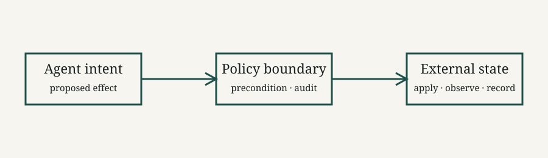

An agent that can act in the world needs more than a clever policy. It needs a way to explain what changed, decide whether a change is safe, and recover when the outside world refuses the plan.

## The useful unit is an effect

Treating an agent step as a single opaque function makes recovery expensive. A more useful boundary is an effect with three parts:

1. an attempted change,
2. an observation of what actually happened,
3. an inverse or compensating action.

The inverse does not need to restore every byte. It needs to restore the invariants that matter to the next decision.

$$
S_{t+1} = \operatorname{apply}(S_t, e_t), \qquad
\operatorname{rollback}(S_{t+1}, e_t) \rightarrow S_t'
$$

Here, $S_t'$ is equivalent to $S_t$ with respect to the runtime's declared invariants. That distinction matters when an external API has observable side effects that cannot literally be undone.

## Make transitions inspectable

The runtime can represent each step as an event rather than passing anonymous mutations between tools:

```python
from dataclasses import dataclass
from typing import Any, Callable

@dataclass
class Effect:
    name: str
    payload: dict[str, Any]
    compensate: Callable[[], None]

    def rollback(self) -> None:
        self.compensate()
```

The event log becomes a compact explanation of the agent's path. It also gives evaluators a stable place to ask questions such as: *which effect introduced the invalid state?*

::: {.callout-important}
### Reversibility is not time travel

Some effects cannot be undone: sending an email, charging a card, or publishing a message. For those operations, the system should model a compensating action and make the residual risk explicit.
:::

## A small execution loop

The control flow is intentionally boring. Boring control flow is valuable when a system is making consequential changes.

```{mermaid}
flowchart LR
    A[Observe state] --> B[Plan effect]
    B --> C{Invariant holds?}
    C -->|yes| D[Apply effect]
    C -->|no| E[Revise plan]
    D --> F[Record event]
    F --> A
    D -->|failure| G[Compensate]
    G --> F
```

In a real runtime, the invariant check may be split into preconditions and postconditions. The important property is that the check is visible in the trace rather than encoded only in a prompt.

{fig-cap="A policy boundary between agent intent and external state."}

## State should have an owner

An effect log is useful only if state ownership is clear. A practical event record might look like this:

```yaml
event_id: evt_0192
actor: planner-7
operation: reserve_inventory
resource: sku-431
before:
  available: 12
after:
  available: 10
compensation: release_inventory
status: committed
```

This makes the runtime's contract concrete: an agent proposes a transition, a policy decides whether it is admissible, and an executor records the result.

## Trade-offs

| Strategy | Strength | Cost |
|:--|:--|:--|
| Snapshot state | Simple recovery model | Expensive for large or external state |
| Event log | Strong explanation and auditability | Requires replay and schema discipline |
| Compensation | Works across service boundaries | The inverse may be partial or unavailable |

The right choice is often hybrid: snapshots for fast restart, events for explanation, and explicit compensation for effects that cross a process boundary.

## What to measure

Rollback changes the runtime's performance profile. Track at least:

- the fraction of effects that require compensation,
- time from failure detection to a safe state,
- the number of unresolved external side effects,
- replay agreement between the log and the current state.

The last metric is particularly important. A system can appear reliable while its trace quietly stops describing reality.

> A system is not trustworthy because it never fails. It is trustworthy when its failures remain legible.

## Closing thought

Reversibility is best understood as a design constraint on the boundary between intention and action. Once that boundary is explicit, rollback, evaluation, and debugging become related views of the same execution record.

This framing builds on the broader systems idea that durable state transitions should be explicit and recoverable [@lamport1978].[^effect-note]

[^effect-note]: In practice, the invariant being restored should be named in the runtime's schema; “undo” without a declared target is too vague to evaluate.

---

**Series:** [Agent Systems](../../series.qmd) · [Next: Observability for Agent Loops](../observability-for-agent-loops/index.qmd)
